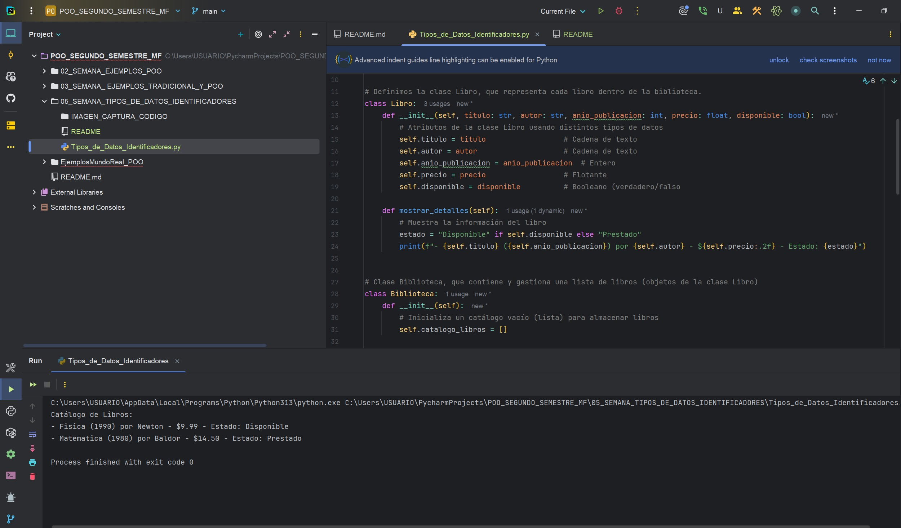

## Semana 05 - Programa: Sistema de Registro de Biblioteca  
**Asignatura:** Programación Orientada a Objetos  
**Autor:** Miguel Flores  
**Descripción:**  
Este programa permite registrar libros en una biblioteca, mostrar el catálogo y buscar si un libro específico está disponible o no.  
Aplica el uso de clases, objetos, tipos de datos y buenas prácticas.  

**Captura de la ejecución del código:**

