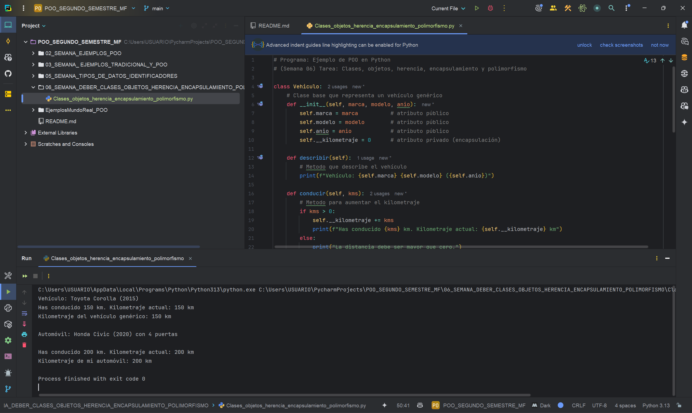

Programa: Sistema de Gestión de Vehículos  
Asignatura: Programación Orientada a Objetos  
Autor: Miguel Flores  
Descripción:  
Este programa permite crear y gestionar información de vehículos y automóviles.  
Demuestra el uso de clases base y derivadas para aplicar herencia, incluye atributos encapsulados para proteger datos internos y emplea polimorfismo mediante la sobrescritura de métodos.  
Aplica conceptos fundamentales de POO como clases, objetos, encapsulación, herencia y polimorfismo usando Python.

