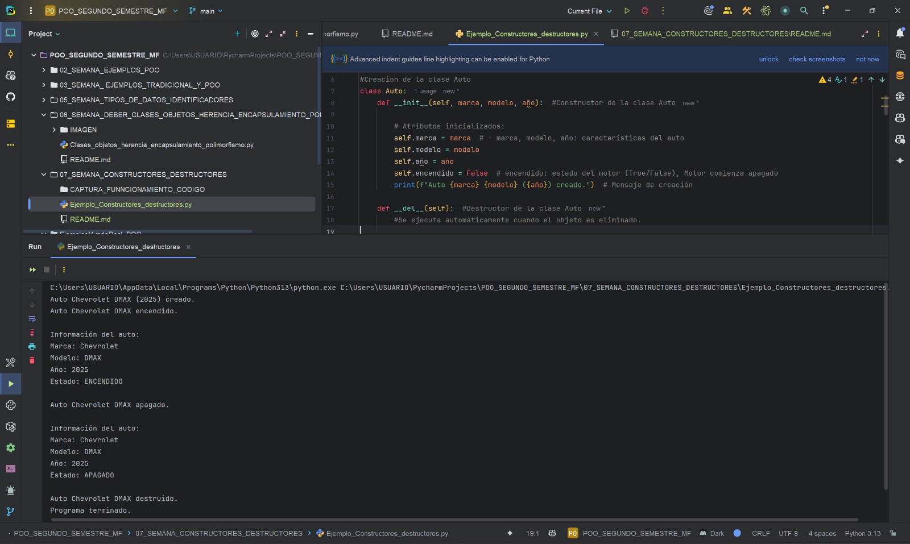

# DEBER SEMANA 07, USO DE CONSTRUCTORES, DESTRUCTORES Y BUENAS PRÁCTICAS DE POO
**Programa:** Control de autos  
**Asignatura:** Programación Orientada a Objetos  
**Autor:** Miguel Ángel Flores Yépez  

## Explicación del funcionamiento:  
1. El constructor (__init__) establece los valores iniciales del auto
2. El destructor (__del__) se asegura de limpiar recursos antes de eliminar el objeto
3. Los métodos encender/apagar controlan el estado del motor
4. mostrar_info() proporciona una vista detallada del estado actual
5. El bloque if __name__ , permite ejecutar el ejemplo solo cuando se ejecuta este archivo directamente

## CAPTURA DEL PROGRAMA EN EJECUCIÓN: 

