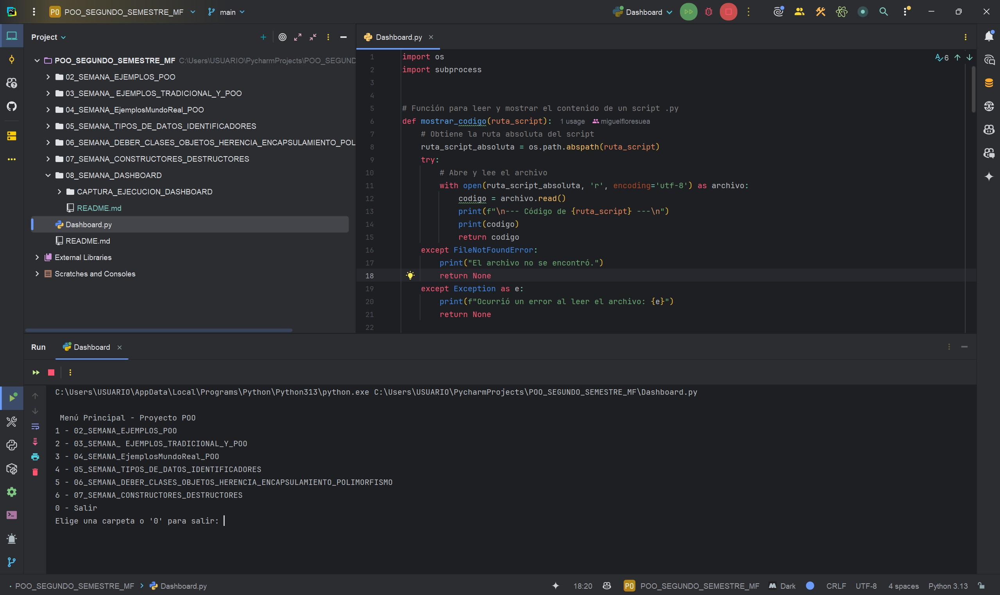

# DEBER SEMANA 08, USO DE CONSTRUCTORES, DESTRUCTORES Y BUENAS PRÁCTICAS DE POO
**Programa:** DASHBOARD  
**Asignatura:** Programación Orientada a Objetos  
**Tema:** 08 Semana, organización del proyecto  
**Autor:** Miguel Ángel Flores Yépez  

## EXPLICACIÓN DEL FUNCIONAMIENTO:  
- El programa llamado Dashboard funciona como una herramienta interactiva en consola que facilita la exploración y ejecución de distintos scripts de Python organizados por semanas en un proyecto de Programación Orientada a Objetos (POO).  
- Al iniciarse, presenta un menú donde el usuario puede elegir una carpeta de ejemplos de cada semana; dentro de esa carpeta, puede ver los scripts .py disponibles, leer su contenido y, si lo desea, ejecutarlos directamente en una consola nueva. De esta forma, el Dashboard permite revisar, estudiar y probar fácilmente los códigos del proyecto, integrando funciones para navegar, visualizar y ejecutar archivos de manera práctica desde un único punto central.  

## CAPTURA 01 MUESTRA MENU DE PROYECTO PERSONAL:

## CAPTURA 02 MUESTRA NAVEGACIÓN ENTRE LAS CARPETAS:

## CAPTURA 03 MUESTRA EL ACCESO A UN EJEMPLO DE UNA CARPETA, MOSTRANDO EL CÓDIGO DEL PROGRAMA:
