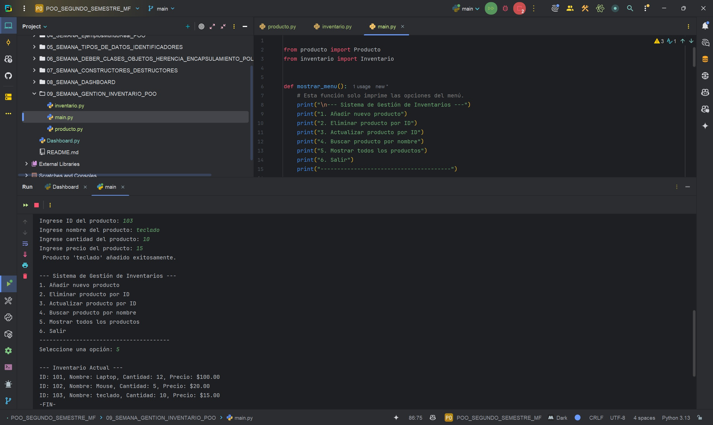
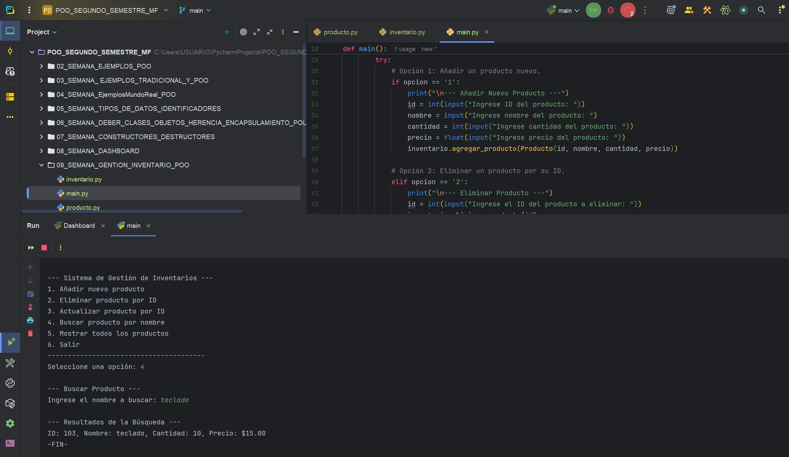

# DEBER SEMANA 07, USO DE CONSTRUCTORES, DESTRUCTORES Y BUENAS PRÁCTICAS DE POO
**Programa:** Gestión de inventario  
**Asignatura:** Programación Orientada a Objetos  
**Autor:** Miguel Ángel Flores Yépez  

## EXPLICACIÓN DEL FUNCIONAMIENTO:  
El programa está dividido en tres partes:  

1. El "Producto" (producto.py): 
- Define qué información debe tener cada producto: un ID, un nombre, una cantidad y un precio. No hace nada por sí solo.
2. El "Inventario" (inventario.py):
- Su trabajo es gestionar el inventario, añadir productos nuevos (y verificar que el ID no se repita), tachar productos que se eliminan, actualizar la cantidad o el precio de un artículo, y buscar  un producto.
3. El "main" (main.py):
- Es el encargado de la gestión de los menus, para acceder a los archivos de inventario y producto. Desde el Main se ejecuta el programa de inventario.

## CAPTURA 01 DEL PROGRAMA EN EJECUCIÓN: 
  

## CAPTURA 02 - INTERACCIÓN POR LAS DIFERENTES OPCIONES DEL PROGRAMA: 
