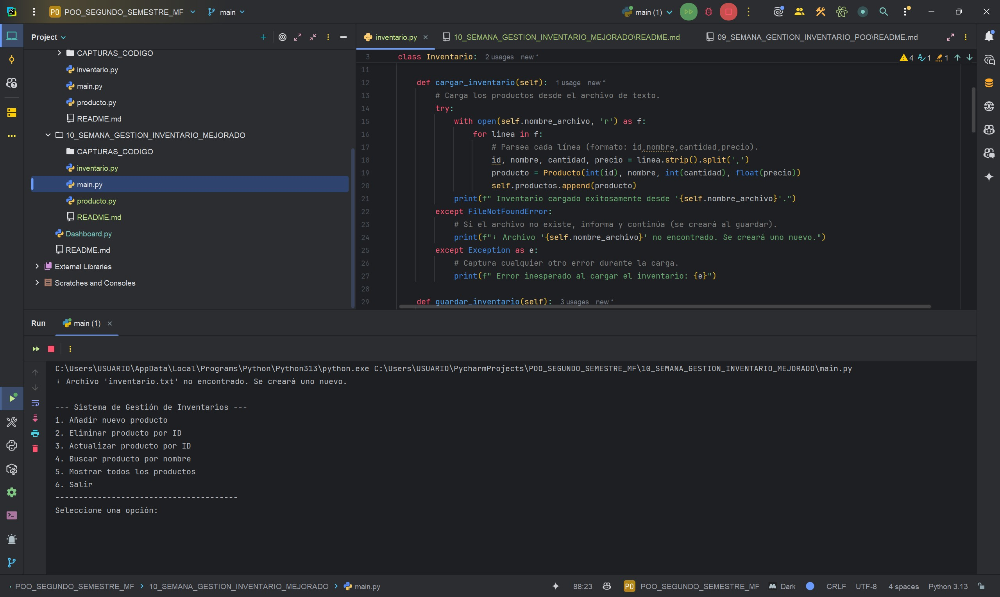
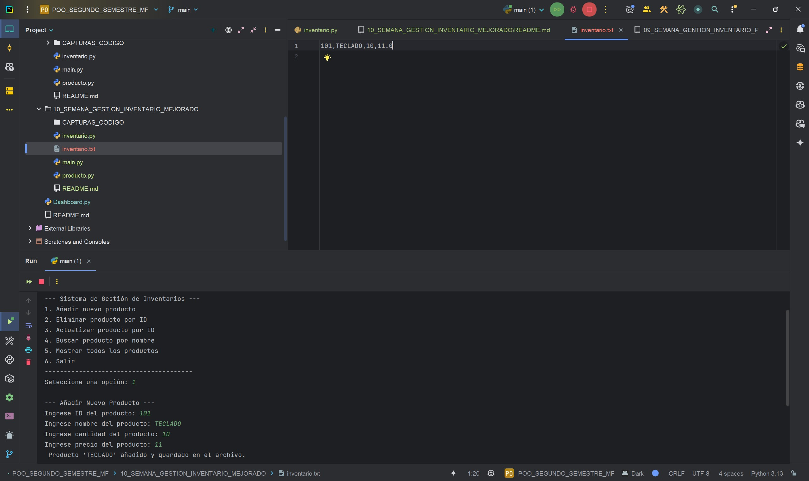
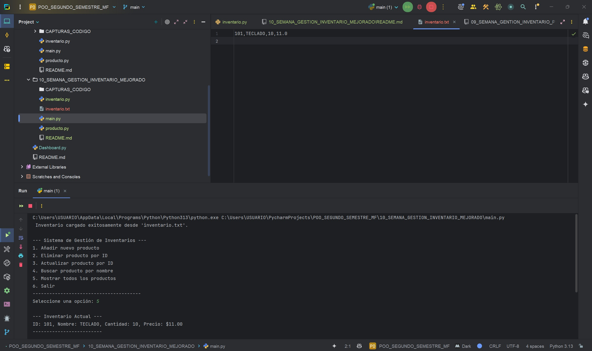

# DEBER SEMANA 10, SISTEMA DE GESTIÒN DE INVENTARIO - MEJORADO  
**Programa:** Gestión de inventario - mejorado  
**Asignatura:** Programación Orientada a Objetos  
**Semana:** 10  
**Autor:** Miguel Ángel Flores Yépez  

## EXPLICACIÓN DE LAS MODIFICACIONES:  

1. Se mejoró el sistema de gestión de inventario para almacenar los datos ingresados en un archivo de texto llamado "inventario.txt"
2. Al iniciar el programa se carga de forma automática los datos que estan almacenados en el archivo de texto llamado "inventario.txt"
3. Se implementaron manejo de excepciones para mostrar mensajes en caso de producirse errores durante la manipulación de archivos y en caso de no existir el archivo "inventario.txt", el programa lo crea de forma automática al guardar el primer producto.
4. Se actualizó la interfaz para mostrar un mensaje que indica si el producto se añadio con exito al inventario.

## CAPTURA 01 - MANEJO DE EXCEPCIONES, EN CASO DE NO EXISTIR EL ARCHIVO INVENTARIO, EL PROGRAMA CREA UN ARCHIVO "inventario.txt":  

## CAPTURA 02 - ALMACENAMIENTO DE INVENTARIOS EN ARCHIVO "inventario.txt" Y MUESTRA MENSAJE DE ÉXITO AL AÑADIR EL PRODUCTO

## CAPTURA 03 - RECUPERACIÓN DEL INVENTARIO DESDE ARCHIVO - CARGA AUTOMATICAMENTE LOS PRODUCTOS EXISTENTES EN "inventario.txt"  

