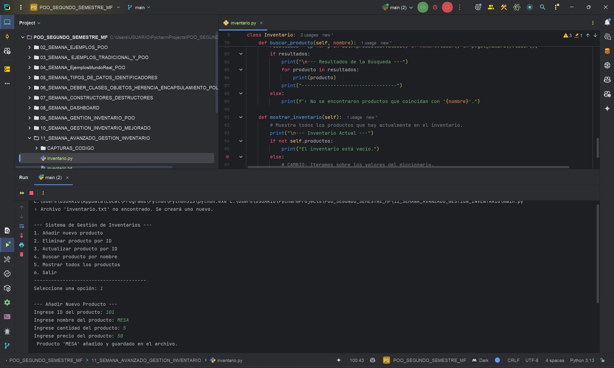

# DEBER SEMANA 10, SISTEMA DE GESTIÒN DE INVENTARIO - AVANZADO  
**Programa:** Gestión de inventario - avanzado  
**Asignatura:** Programación Orientada a Objetos  
**Semana:** 11  
**Autor:** Miguel Ángel Flores Yépez  

# Sistema de Gestión Avanzada de Inventario en Python

---

## Características Principales

* **Arquitectura Orientada a Objetos**: El sistema está claramente dividido en clases (`Producto`, `Inventario`), lo que facilita su comprensión y futuras expansiones.
* **Gestión Eficiente de Datos**: Utiliza un **diccionario** de Python para almacenar el inventario, usando el ID del producto como clave. Esto permite que las operaciones de acceso, inserción y eliminación se realicen en tiempo constante (`O(1)`), garantizando un alto rendimiento sin importar el tamaño del inventario.
* **Persistencia de Datos**: El estado del inventario se guarda automáticamente en un archivo de texto (`inventario.txt`). Los datos se cargan al iniciar la aplicación y se actualizan con cada modificación.
* **Interfaz de Usuario Interactiva**: Proporciona un menú de consola claro y sencillo que guía al usuario a través de las diferentes funcionalidades disponibles.
* **Manejo de Errores**: La aplicación está diseñada para gestionar entradas de usuario incorrectas y otros posibles errores de tiempo de ejecución de manera controlada.

---

## Estructura del Proyecto

El proyecto está compuesto por tres archivos modulares:

1.  **`producto.py`**: Contiene la clase `Producto`, que modela los artículos del inventario con atributos como `ID`, `nombre`, `cantidad` y `precio`.
2.  **`inventario.py`**: Define la clase `Inventario`, que orquesta todas las operaciones. Es responsable de manejar la colección de productos, implementar la lógica de negocio y gestionar la escritura y lectura del archivo de persistencia.
3.  **`main.py`**: Es el punto de entrada de la aplicación. Su función es presentar el menú al usuario, capturar sus elecciones y llamar a los métodos correspondientes de la clase `Inventario`.
- El menú del sistema se mostrará en la consola, listo para ser utilizado. El archivo `inventario.txt` se creará automáticamente en el mismo directorio tras el primer registro de un producto nuevo.

---

## CAPTURAS DEL FUNCIONAMIENTO:   

## CAPTURA 01 - AÑADIR NUEVOS PRODUCTOS:  

## CAPTURA 02 - ELIMINAR PRODUCTOS POR ID:  

## CAPTURA 03 - ACTUALIZAR CANTIDAD Y PRECIO DE UN PRODUCTO:    

## CAPTURA 04 - BUSCAR Y MOSTRAR PRODUCTOS POR NOMBRE:    

## CAPTURA 05 - MOSTRAR TODOS LOS PRODUCTOS:    
