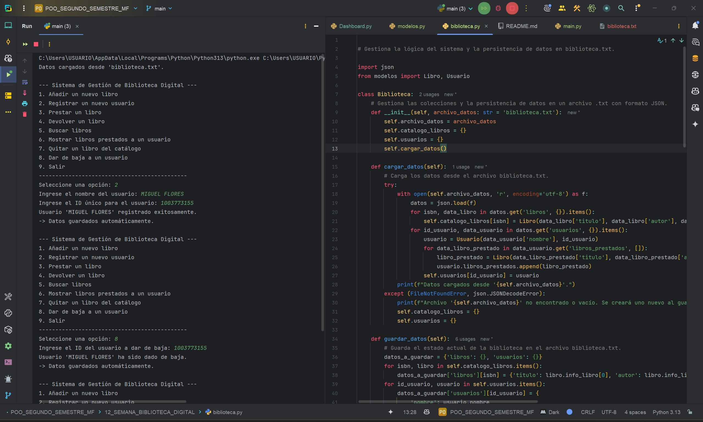
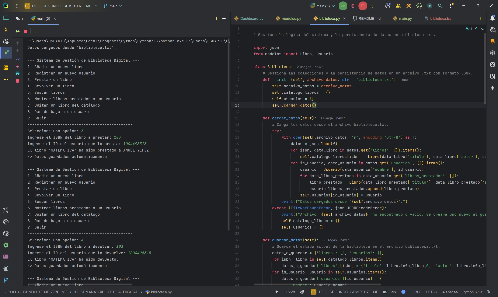
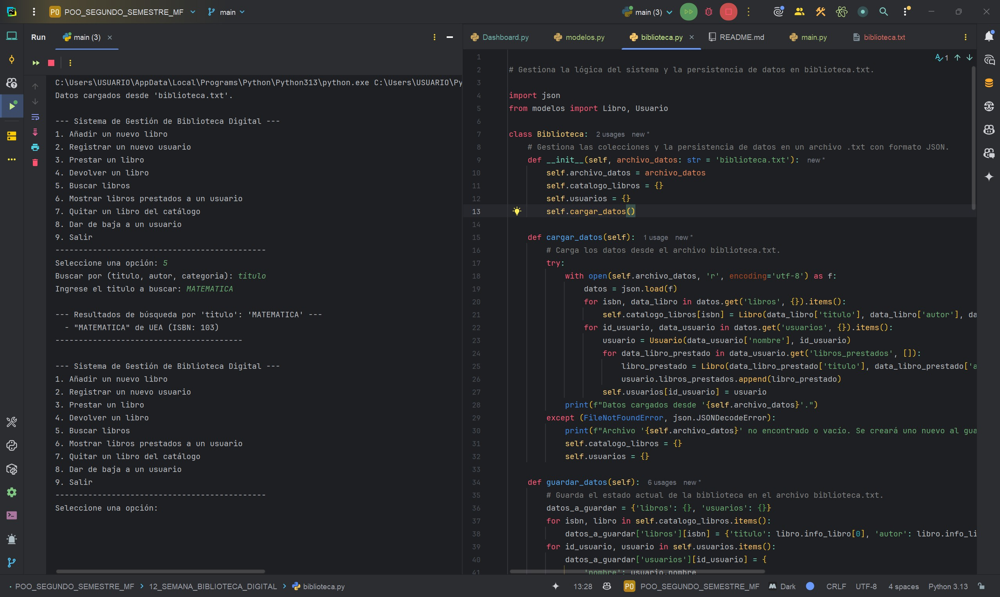
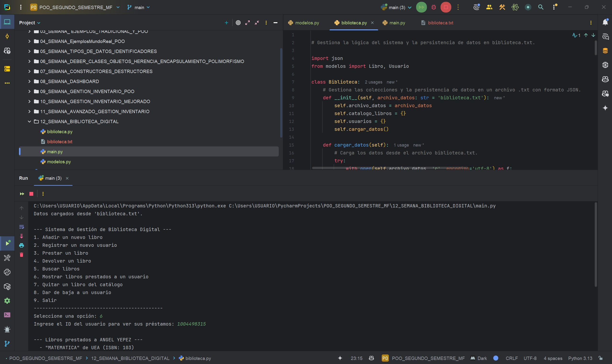

# DEBER, SISTEMA DE GESTIÓN DE BIBLIOTECA DIGITAL  
**Programa:** Gestión de Bilioteca Digital  
**Asignatura:** Programación Orientada a Objetos  
**Semana:** 12  
**Autor:** Miguel Ángel Flores Yépez  

---
# Sistema de Gestión de Biblioteca Digital en Python

Sistema interactivo para la gestión de una biblioteca digital, desarrollado en Python y enfocado en los principios de la Programación Orientada a Objetos (POO). Permite administrar libros, registrar usuarios y gestionar préstamos de manera eficiente.

---
## Características Principales

* **Gestión de Libros**: Añadir y quitar libros del catálogo.
* **Gestión de Usuarios**: Registrar nuevos usuarios y dar de baja a los existentes.
* **Sistema de Préstamos**: Prestar y devolver libros, actualizando automáticamente el estado de la biblioteca.
* **Búsqueda Avanzada**: Buscar libros por título, autor o categoría.
* **Seguimiento**: Listar todos los libros que un usuario específico tiene en préstamo.
* **Persistencia de Datos**: Toda la información se guarda automáticamente en un archivo `biblioteca.txt`, por lo que los datos no se pierden al cerrar la aplicación.

---
## Estructura del Proyecto

El código está organizado de manera modular para facilitar su comprensión, mantenimiento y escalabilidad.

* ### `modelos.py`
    Este módulo define las "plantillas" o clases de datos del sistema. Contiene las clases `Libro` y `Usuario`, que actúan como moldes para crear los objetos con los que trabajará el programa.

* ### `biblioteca.py`
    Es el "motor" del sistema. Contiene la clase `Biblioteca`, que encapsula toda la lógica de negocio: cómo se añaden los libros, cómo se gestionan los usuarios y cómo funcionan los préstamos. También es responsable de cargar y guardar los datos en el archivo de persistencia.

* ### `main.py`
    Este es el punto de entrada de la aplicación. Contiene la interfaz de usuario de consola (CLI), que muestra el menú interactivo, procesa las entradas del usuario y llama a los métodos correspondientes de la clase `Biblioteca`.

---
## Persistencia de Datos

El sistema guarda automáticamente todo su estado (libros disponibles, usuarios registrados y libros prestados) en un archivo llamado **`biblioteca.txt`**.

* Al iniciar la aplicación, el sistema intenta cargar los datos desde este archivo.
* Si el archivo no existe, se inicia una biblioteca vacía y el archivo se creará la primera vez que se realice una operación de guardado.
* Cada vez que se realiza una acción que modifica los datos (añadir un libro, prestar, etc.), los cambios se guardan de forma instantánea en el archivo.

---
## Estructura

La elección de las estructuras de datos fue clave para garantizar un sistema eficiente y robusto:

* **Tuplas (`tuple`)**: Se usan en la clase `Libro` para almacenar el `(título, autor)`. Al ser inmutables, protegen estos datos de modificaciones accidentales.
* **Listas (`list`)**: Se emplean para gestionar los `libros_prestados` de cada `Usuario`. Al ser mutables, son perfectas para una colección que cambia dinámicamente.
* **Diccionarios (`dict`)**: Son el núcleo de la clase `Biblioteca` para almacenar el catálogo de libros y los usuarios. Usar el ISBN o el ID de usuario como clave permite un acceso a los datos casi **instantáneo y muy eficiente**.

---
## CAPTURAS DEL CÓDIGO EN EJECUCIÓN

## 01_AÑADIR_QUITAR_LIBROS

---
## 02_REGISTRAR_DAR_DE_BAJA_USUARIOS

---
## 03_PRESTAR_DEVOLVER_LIBROS

---
## 04_BUSCAR_LIBROS

---
## 05_LISTAR_LIBROS_PRESTADOS  

