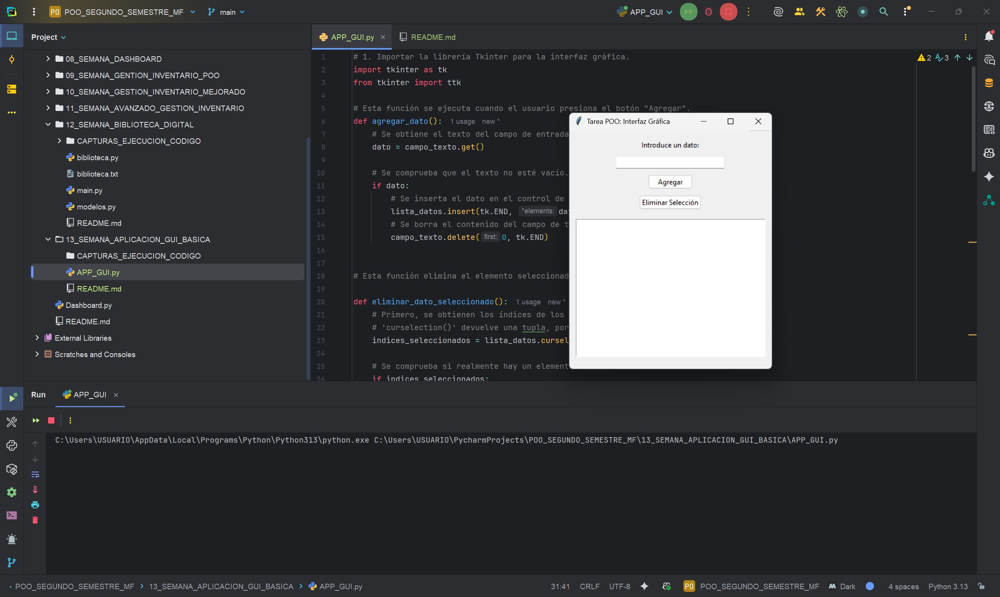
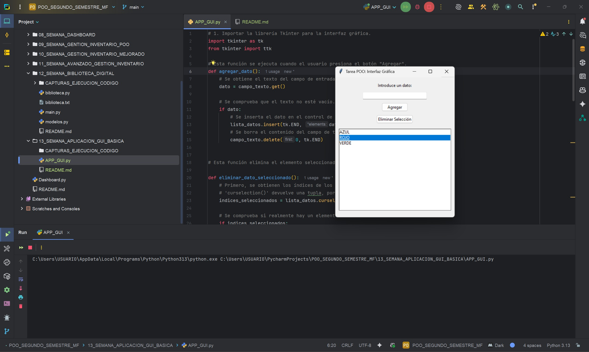

# Creación de una Aplicación GUI Básica  
**Programa:** Aplicación GUI Básica  
**Asignatura:** Programación Orientada a Objetos  
**Semana:** 13  
**Autor:** Miguel Ángel Flores Yépez  

---
## Descripción

La aplicación proporciona una interfaz gráfica de usuario (GUI) que permite a los usuarios realizar dos operaciones básicas:
1.  **Agregar datos**: Los usuarios pueden escribir texto en un campo de entrada y agregarlo a una lista.
2.  **Eliminar datos**: Los usuarios pueden seleccionar un elemento de la lista y eliminarlo.

---

## Características 

* **Interfaz Gráfica Intuitiva**: Creada con `Tkinter`, la librería estándar de Python para GUI.
* **Entrada de Datos**: Un campo de texto para que el usuario ingrese la información.
* **Visualización de Datos**: Una lista (`Listbox`) que muestra todos los datos agregados.
* **Funcionalidad de Agregar**: Un botón "Agregar" que añade el texto del campo de entrada a la lista.
* **Funcionalidad de Eliminar**: Un botón "Eliminar Selección" que borra el dato actualmente seleccionado en la lista. Conectando el clic con la función 'eliminar_dato_seleccionado'.

---
## CAPTURAS DEL CÓDIGO EN EJECUCIÓN

## 01_EJECUCIÓN_DEL_PROGRAMA_MUESTRA_INTERFAZ_GUI

---
## 02_FUNCIONALIDAD_AGREGAR_DATOS_A_LA_LISTA

---
## 03_SELECCIONAMOS_DATO_PARA_ELIMINAR

---
## 04_CLIC_BOTÓN_ELIMINAR_PARA_BORRAR_DATO_SELECCIONADO

---

