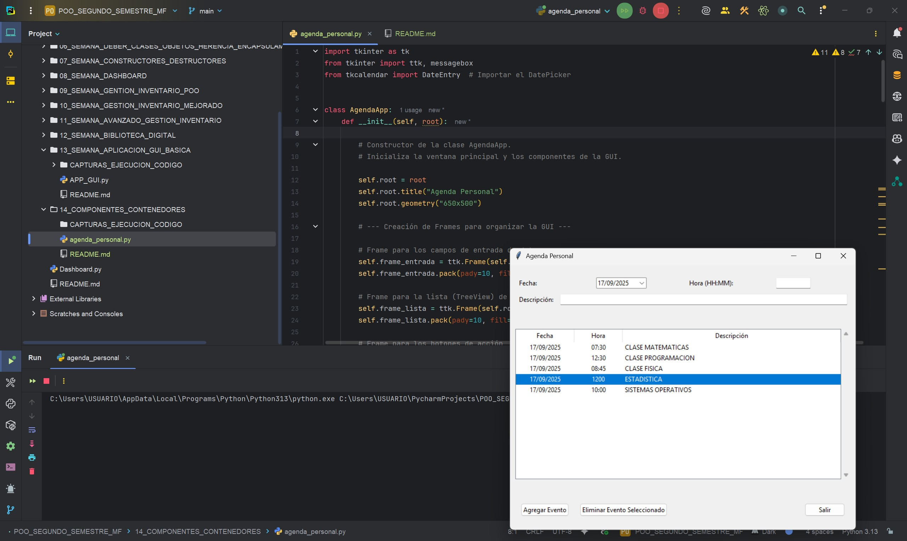

# Creación de una Aplicación de Agenda Personal  
**Programa:** Aplicación Agenda Personal GUI
**Asignatura:** Programación Orientada a Objetos  
**Semana:** 14  
**Autor:** Miguel Ángel Flores Yépez  

---
# Funcionamiento del Programa: Agenda Personal GUI

Esta aplicación es una agenda personal simple desarrollada en Python utilizando la biblioteca `Tkinter` para la interfaz gráfica. Permite a los usuarios agregar, visualizar y eliminar eventos.

---
### Características Principales

* **Agregar y Eliminar Eventos**: Interfaz intuitiva para añadir nuevas tareas o eliminar las existentes.
* **Selector de Fecha**: Incluye un widget `DateEntry` (DatePicker) para una fácil selección de la fecha.
* **Confirmación de Borrado**: Muestra un diálogo de confirmación antes de eliminar un evento.

---
### Bibliotecas de Python:

* **Tkinter** (`tkinter`, `tkinter.ttk`, `tkinter.messagebox`): La biblioteca estándar de Python para crear interfaces gráficas.
* **tkcalendar** (`DateEntry`): Una biblioteca externa necesaria para implementar el widget de selección de fecha (DatePicker).

---
## CAPTURAS DEL CÓDIGO EN EJECUCIÓN

## 01_CAPTURA_AGREGAR_EVENTO   

---
## 02_CAPTURA_SELECCIONAR_Y_ELIMINAR_EVENTO   

---
## 03_CAPTURA_MENSAJE_CONFIRMACION_ELIMINAR   

---
## 04_CAPTURA_SELECTOR_FECHA   

---

