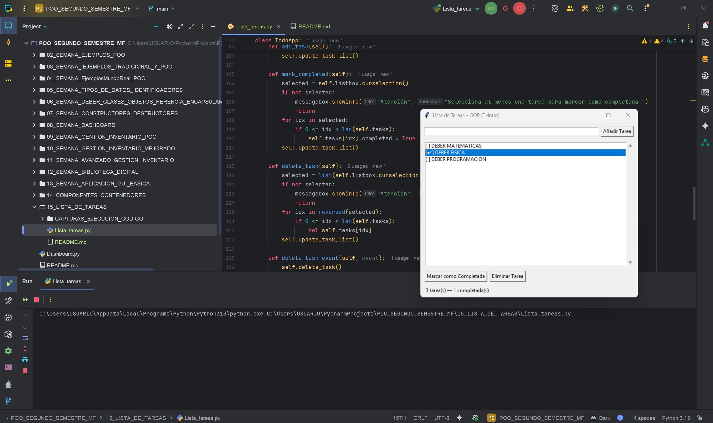
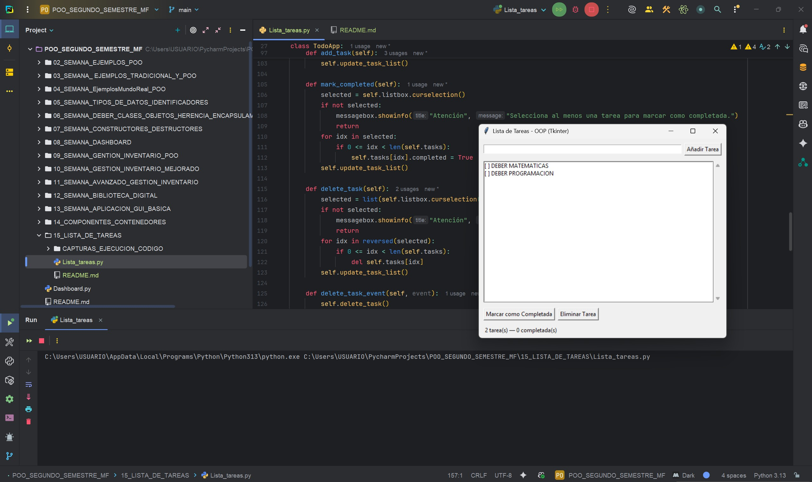

# Creación de una Aplicación de Lista de Tareas  
**Programa:** Aplicación Lista de Tareas GUI  
**Asignatura:** Programación Orientada a Objetos  
**Semana:** 15  
**Autor:** Miguel Ángel Flores Yépez  

---

# Funcionamiento del Programa: Lista de Tareas GUI

Esta aplicación es una lista de tareas simple desarrollada en Python utilizando la biblioteca `Tkinter` para la interfaz gráfica.  
Permite a los usuarios agregar tareas, marcarlas como completadas y eliminarlas** de manera interactiva.  

---

### Características Principales

* **Agregar Tareas**: Campo de texto y botón para añadir nuevas tareas. También se puede usar la tecla **Enter**.  
* **Marcar como Completada**: Botón para marcar la tarea seleccionada o **doble clic** para alternar su estado.  
* **Eliminar Tareas**: Botón para eliminar las seleccionadas o presionar la tecla **Delete**.  
* **Visualización del Estado**: Las tareas completadas se muestran con un visto (✔).  
* **Contador de Estado**: Una barra inferior muestra el total de tareas y cuántas están completadas.  

---

### Bibliotecas de Python:

* **Tkinter** (`tkinter`, `tkinter.messagebox`, `tkinter.font`): Biblioteca estándar de Python para crear interfaces gráficas.  

---

## CAPTURAS DEL CÓDIGO EN EJECUCIÓN

## 01_CAPTURA_AÑADIR TAREAS   

---
## 02_CAPTURA_MARCAR_TAREAS_COMPLETADAS   

---
## 03_CAPTURA_ELIMINAR_TAREAS

---

