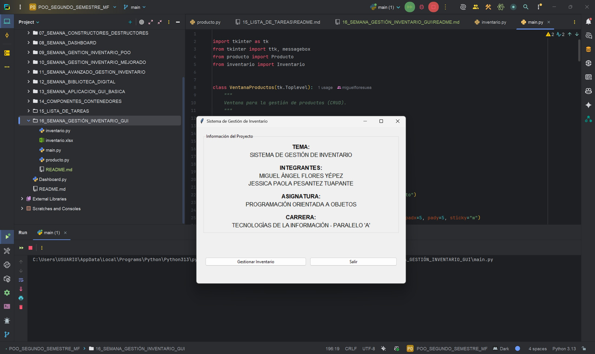
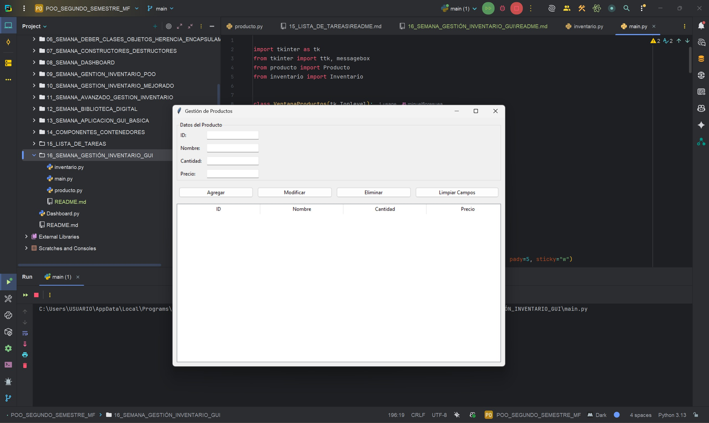
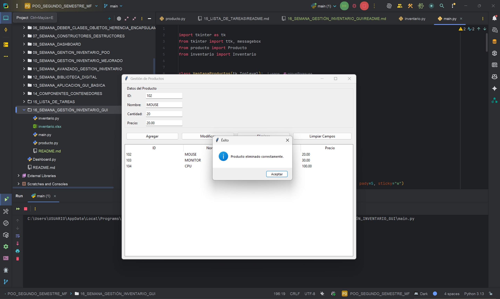
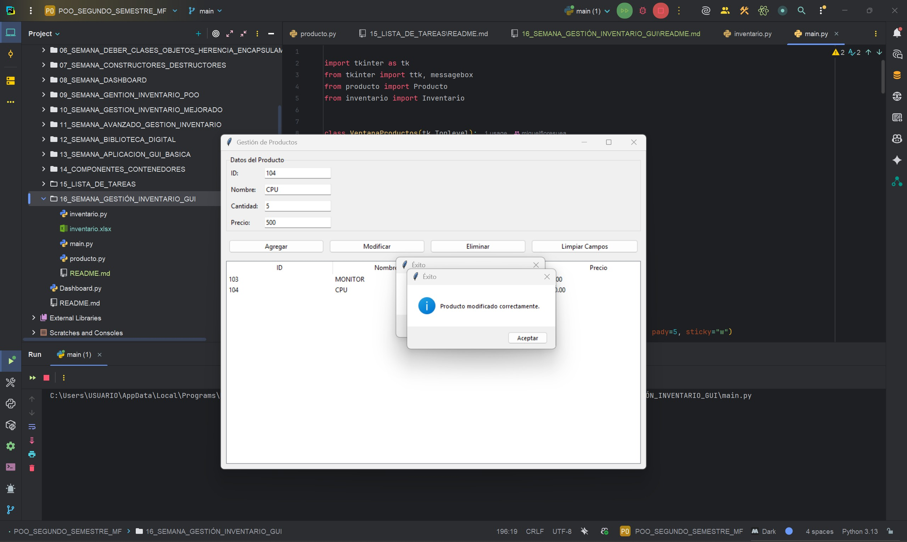
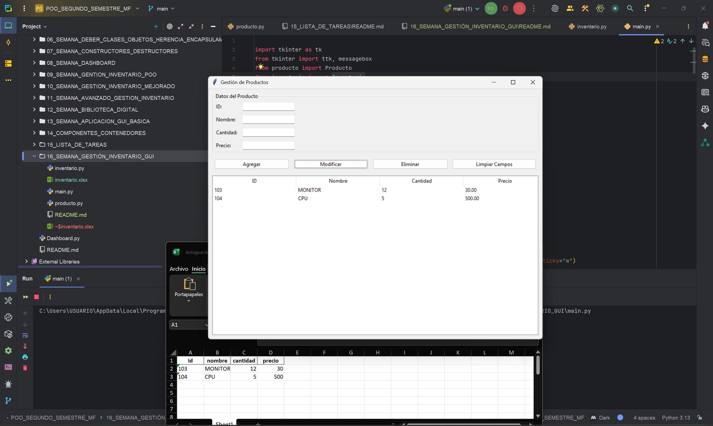

# Sistema de Gestión de Inventario - GUI  

**Programa:** Sistema de Gestión de Inventario  
**Asignatura:** Programación Orientada a Objetos  
**Semana:** 15  
**Autores:**  
Miguel Ángel Flores Yépez  
Jessica Paola Pesantez Tuapante

---

## Funcionamiento del Programa: Gestión de Inventario GUI

Este proyecto es una aplicación de escritorio desarrollada en Python que permite la gestión completa de un inventario de productos a través de una interfaz gráfica creada con la biblioteca `Tkinter`.  

El sistema ofrece funcionalidades esenciales como agregar, modificar, eliminar, buscar y visualizar productos, mientras almacena toda la información en un archivo Excel para garantizar la persistencia de datos.

---

## Características Principales

- **Agregar productos:** Permite registrar nuevos productos con sus atributos: ID, nombre, cantidad y precio.  
- **Modificar productos:** Posibilidad de actualizar el nombre, cantidad o precio de un producto existente.  
- **Eliminar productos:** Elimina productos seleccionados del inventario de forma segura y actualiza el archivo Excel.  
- **Visualizar inventario:** Muestra todos los productos en una interfaz gráfica, en una tabla con sus respectivos detalles.  
- **Persistencia de datos:** La información se guarda automáticamente en `inventario.xlsx`.

---

## Estructura del Proyecto

El proyecto está dividido en tres módulos principales:

### 1. `producto.py`
Contiene la clase `Producto`, que representa cada elemento del inventario.  
- Atributos: `id`, `nombre`, `cantidad`, `precio`.  
- Métodos: getters, setters y conversión a diccionario.

### 2. `inventario.py`
Contiene la clase `Inventario`, que gestiona la colección de productos.  
- Funciones principales: agregar, eliminar, modificar, buscar, guardar y cargar productos desde Excel.

### 3. `main.py`
Archivo principal que implementa la interfaz gráfica con `Tkinter`.  
- Proporciona botones, campos de texto y tablas interactivas para la gestión del inventario.

---

## Bibliotecas Utilizadas

- **Tkinter:** Biblioteca estándar de Python para crear interfaces gráficas.  
- **Pandas:** Permite la manipulación y persistencia de datos en archivos Excel.  
- **Openpyxl:** Motor utilizado por `pandas` para trabajar con archivos `.xlsx`.

---

## CAPTURAS DEL CÓDIGO EN EJECUCIÓN

## 01_CAPTURA_EJECUCION_PROGRAMA_VENTANA_01

---
## 02_CAPTURA_VENTANA_GESTION_INVENTARIO

---
## 03_CAPTURA_ELIMINAR_PRODUCTO

---
## 04_CAPTURA_MODIFICAR_PRODUCTO

---
## 05_CAPTURA_MANEJO_ARCHIVOS

---

